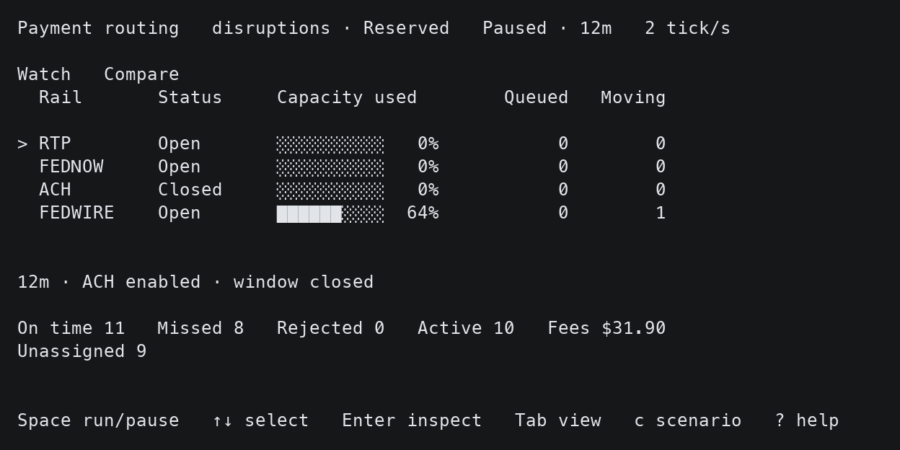

# Payment routing

A cheap payment route may be too slow. A fast route may run out of capacity.
When many payments share the same rails, routing each one affects the others.

This simulation lets you watch those tradeoffs unfold, compare strategies,
and inspect individual payments as demand and constraints change.

## Watch it

```sh
cargo run --locked -- --demo
```

Requires Rust and an interactive terminal of at least **80 × 18**.
No server, credentials or database needed.



**Space** runs or pauses. **Tab** switches Watch / Compare. **Enter** inspects.
Use **c** to choose a scenario and **?** for all controls.

Watch shows rail capacity, queues and payments in flight. Compare shows outcomes
and fees for the same demand. Select a payment difference to inspect both journeys.

## Strategies

- **Static** picks the cheapest currently usable route and waits to execute it.
- **Reserved** plans departure times and reserves future capacity with a bounded search.

Neither wins every workload. Compare delivery outcomes before fees;
spending less can mean delivering fewer payments.

## Model

Fictional institutions share synthetic USD rails with fees, service windows,
capacity and payment deadlines. Scenarios add demand pressure and rail disruptions.
The rail names are familiar; their rules and timings are synthetic.
No real transfers occur, and opening balances are descriptive.

## Details

- [Demo guide](docs/operations-console.md): controls, metrics and inspection.
- [Strategy evaluation](docs/evaluation.md) and [results](docs/evaluation-report.md).
- [Simulation](docs/simulation.md), [reserved routing](docs/scalable-routing.md) and [disruptions](docs/disruptions.md).
- [Exact routing](docs/exact-routing.md), [timetables](docs/time-model.md) and [static fixture](docs/reference-network.md).
- [Benchmarks](benchmarks/README.md) and [development](docs/development.md).
